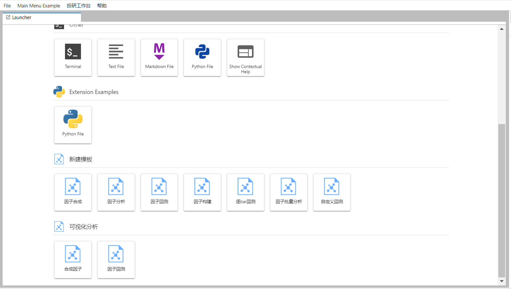
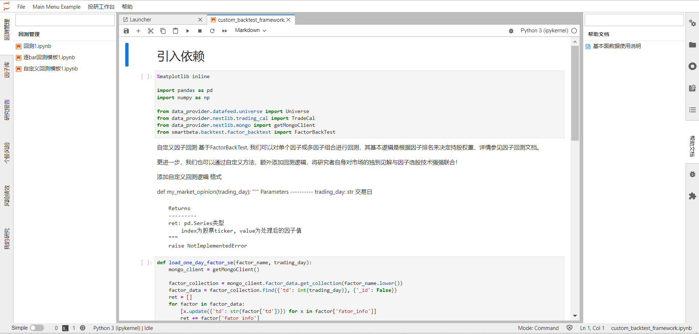

# jupyterlab扩展插件开发

launch和py_left_widget是两个jupyterlab extension的目录，放在任意anaconda虚拟环境目录下即可

launch包含Launcher界面的按钮组件

py_left_widget包含左侧右侧的sidebar组件

## 参考
jupyterlab原生代码包
https://github.com/jupyterlab/jupyterlab/tree/master/packages

lumino代码包，包含jupyterlab常用组件
https://github.com/blink1073/lumino/tree/69babebb9528218bfecc3d3104a1b913d90e9f14/packages

jupyterlab单一插件教程
https://github.com/jupyterlab/extension-examples

## 插件引入
#go to the extension dir

   cd launch

#install the extension in editable mode

   python -m pip install -e .

#install your development version of the extension with JupyterLab
#扩展目录连接到lab，重要

   jupyter labextension develop . --overwrite         

#build the TypeScript source after making changes

   jlpm run build

#start JupyterLab

   jupyter lab

#If you want to develop and iterate on the code, you will need to open 2 terminals.
#In terminal 1, go to the extension folder and run the following:

   jlpm watch

#Then in terminal 2, start JupyterLab with the watch flag:

   jupyter lab --watch

## 下一步计划

加入更多文档，代码（东吴）

界面中心widget组件，包含更丰富的内容和功能

sidebar搜索栏，多组件组合达成更好的UI效果

组件变量之间的交互，属性调用，改动响应函数

遮去原生的jupyter标记和图标sidebar

                                            zym 20220128

